# Journeymate
Journeymate es una aplicación la cual resuelve el siguiente problema: "No conozco que lugares visitar o nisiquiera tengo dinero para viajar o para visitar lugares dentro de mi ciudad, por eso siempre recurro a los mismos lugares".  
Esta aplicación resuelve el problema implementando rutinas de viaje realizadas por otras personas, donde se proponen o recomiendan lugares para visitar explicando en donde se encuentra dicho o dichos lugares, descripción entre otras cosas

## Tecnologias utilizadas
NodeJs  
Asp.net core  
Kotlin  
MongoDB

## Creadores

Axel Jordano Morales Utrera  
Daniel Eduardo Anota Paxtian

## Video de presentacion
[Clic para ver video de presentacion de clientes](https://youtu.be/u6hUdmUrJj8)  

### Repositorios originales:
[Clic para ir al repositorio del API](https://github.com/AxelUtrera/JourneymateAPI)  
[Clic para ir al repositorio del cliente web](https://github.com/AxelUtrera/Jorneymate-WEB)     
[Clic para ir al repositorio del cliente de escritorio](https://github.com/DPaxtian/Journeymate-Desktop)  
[Clic para ir al repositorio del cliente movil](https://github.com/DPaxtian/Journeymate-Kotlin) 

## Capturas de pantalla
### Cliente movil
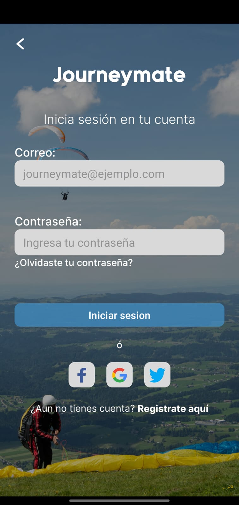

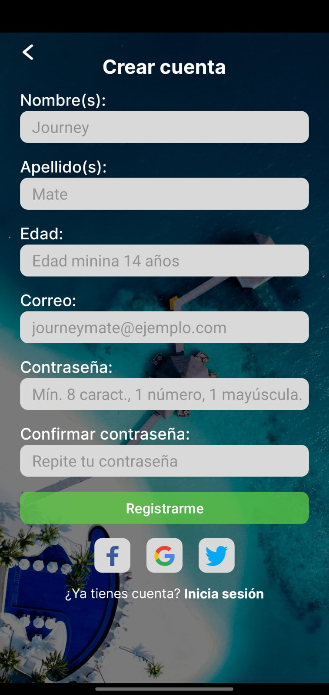  

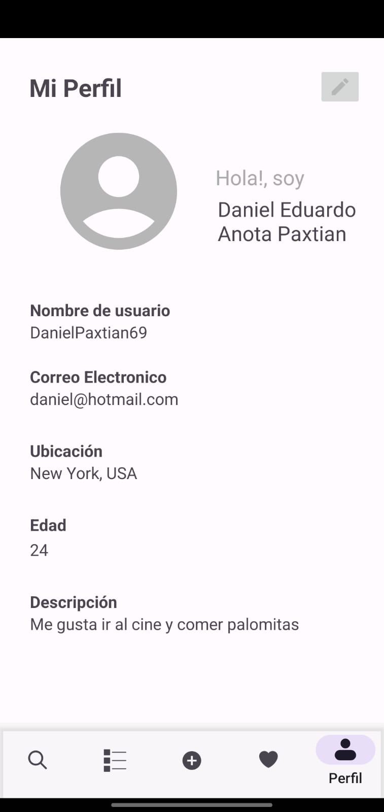  

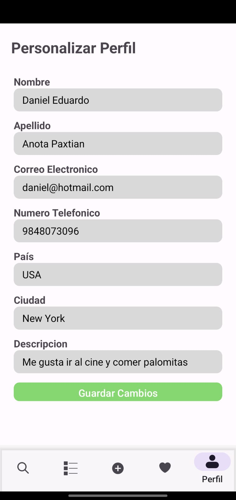  

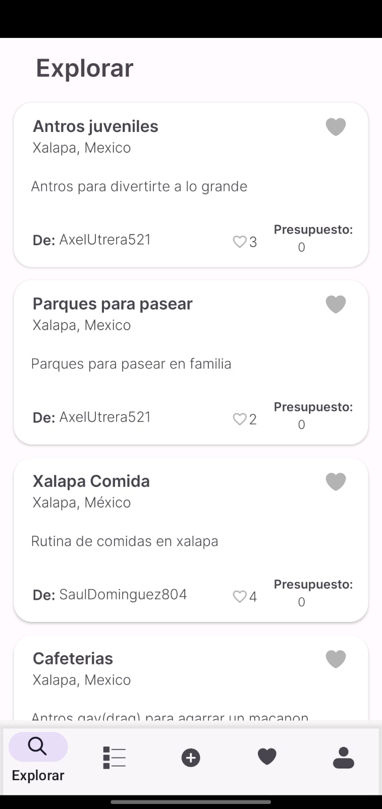

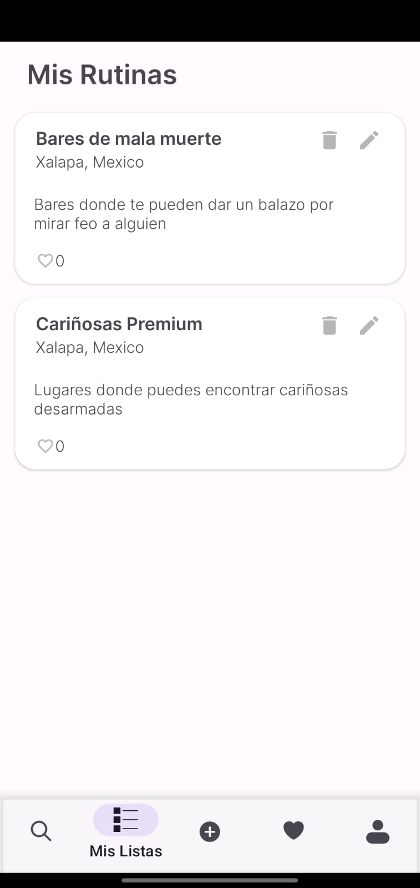

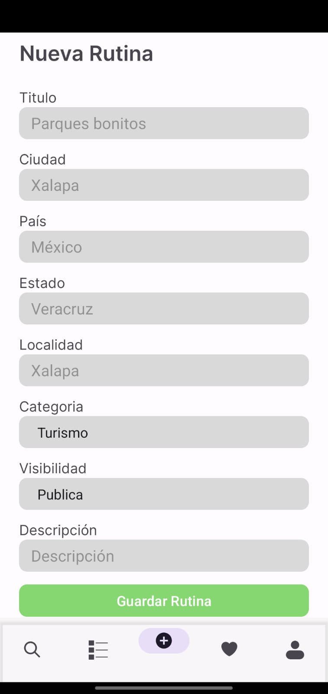 

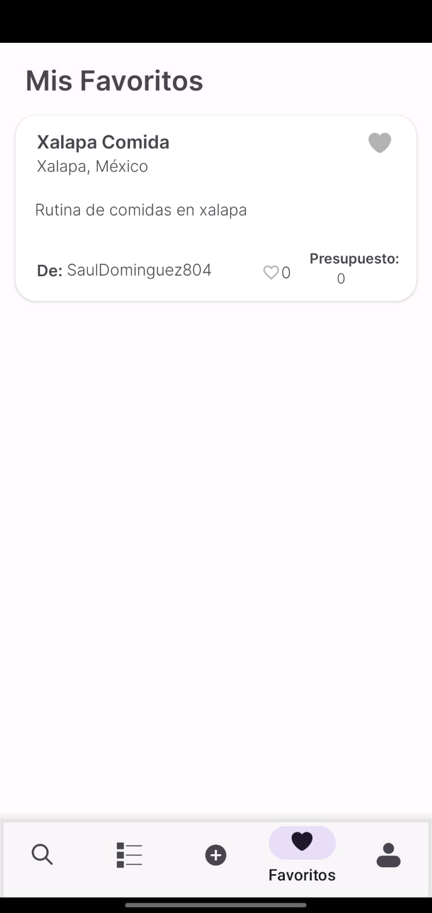

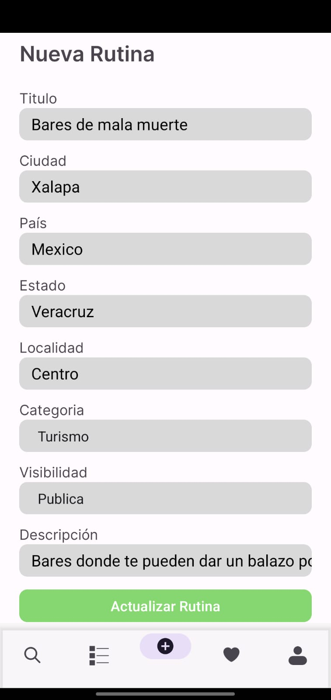  

### Cliente web  
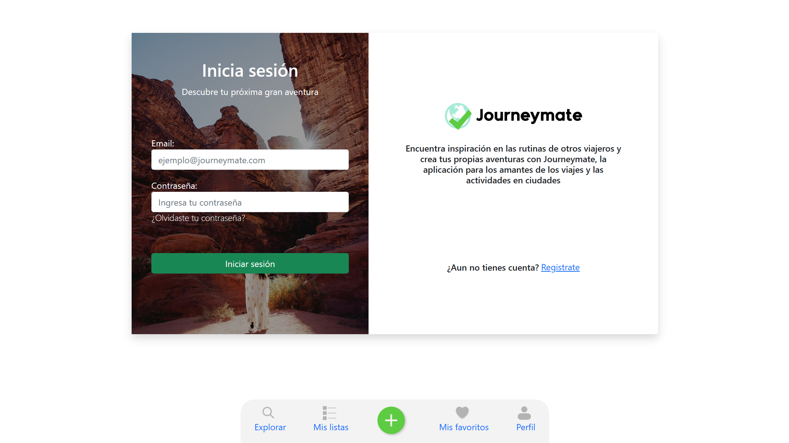

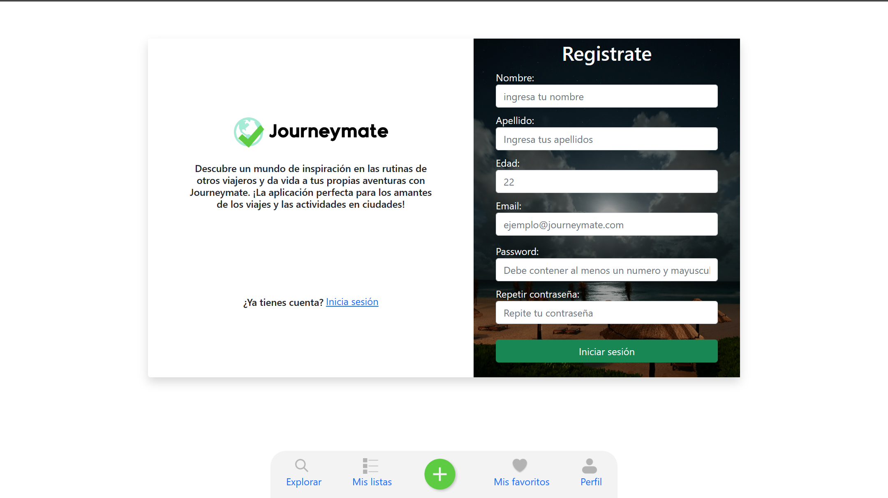  

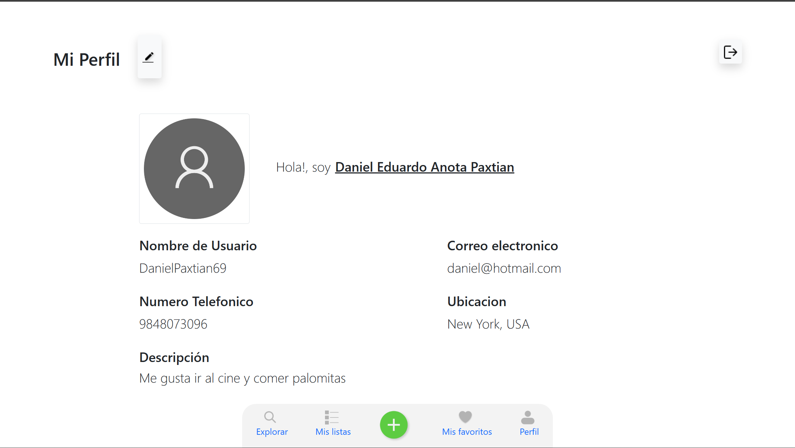  

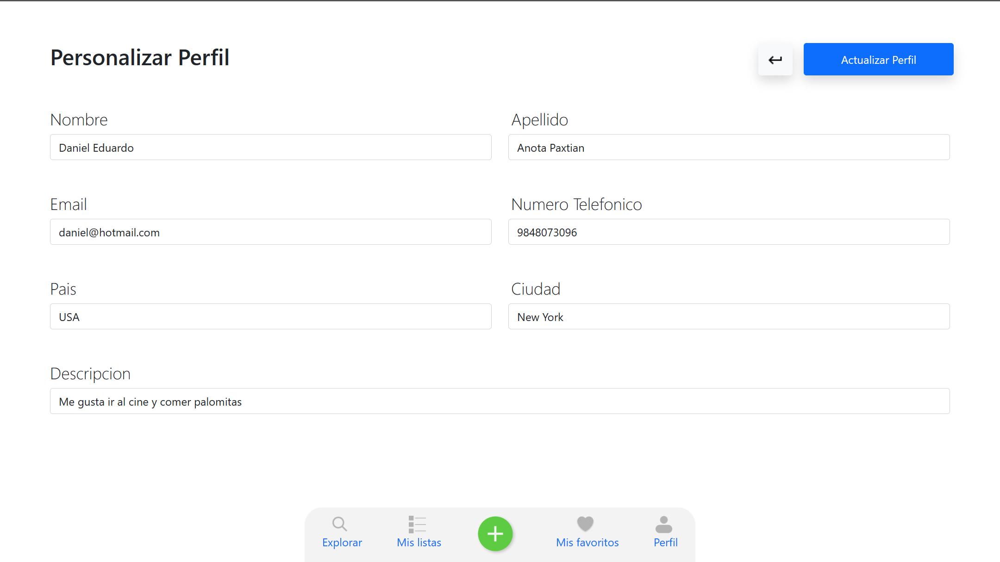  

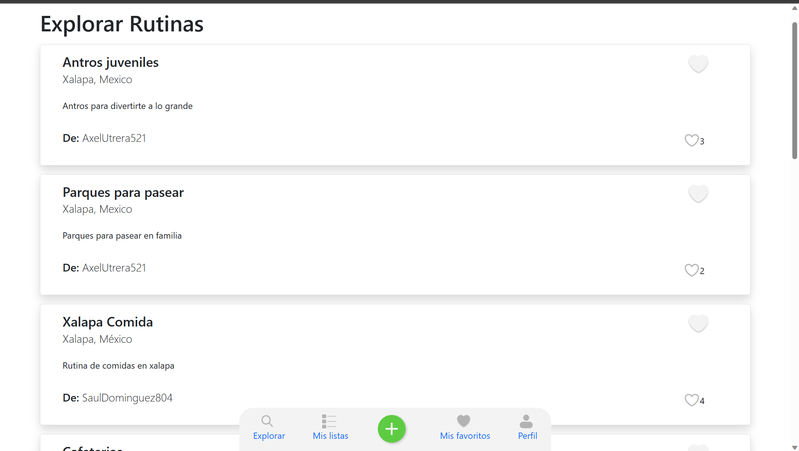

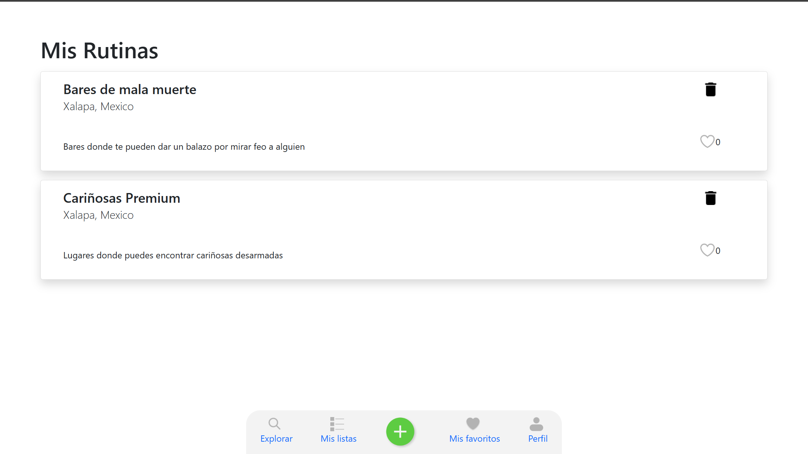

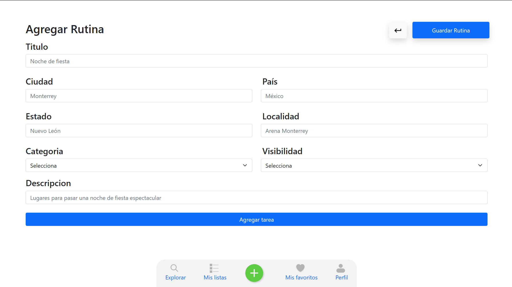 

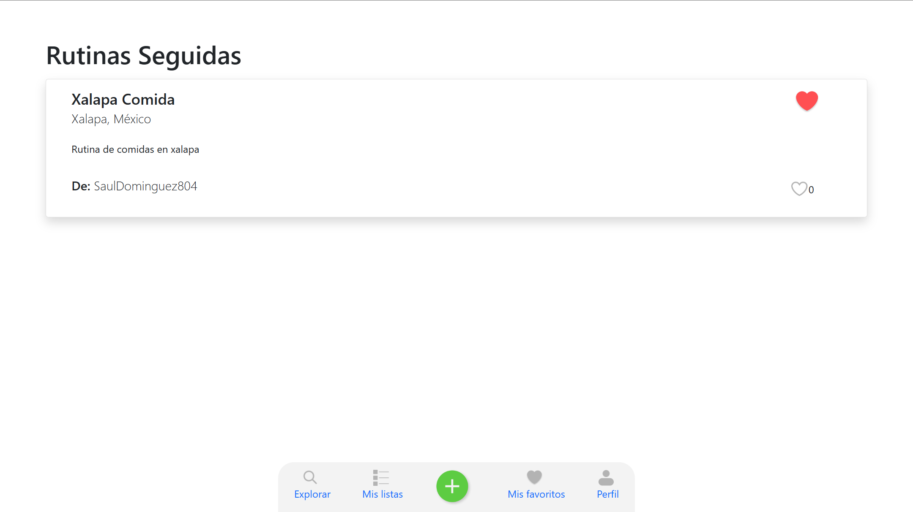

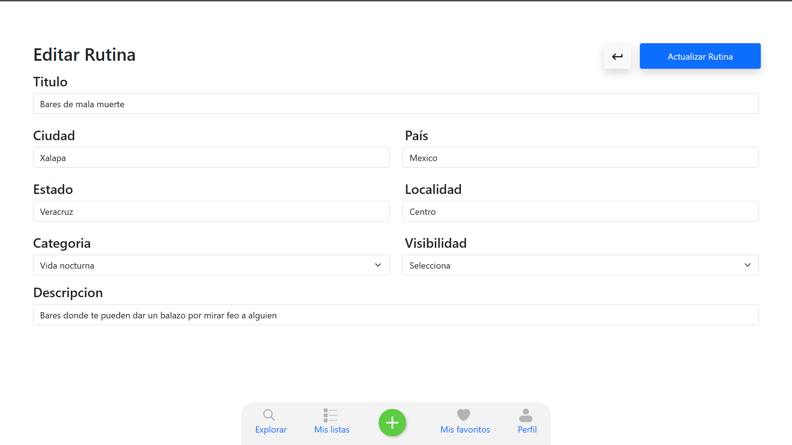  

